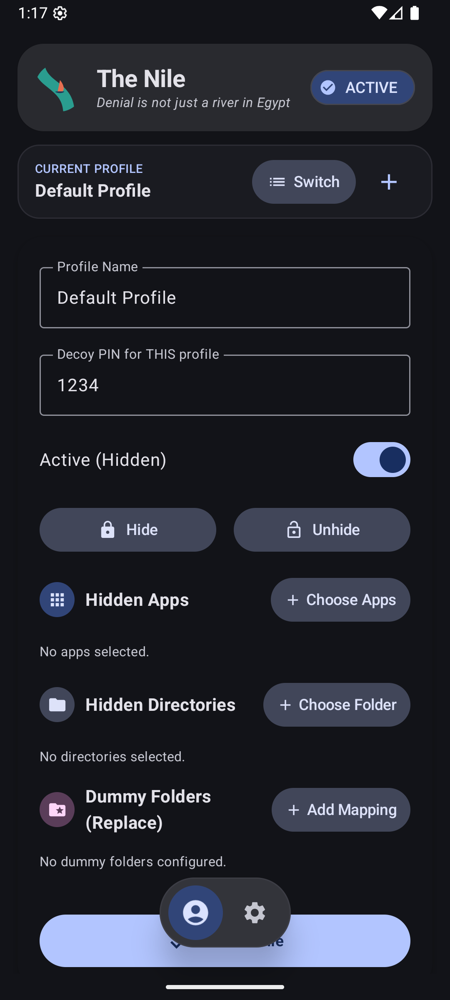
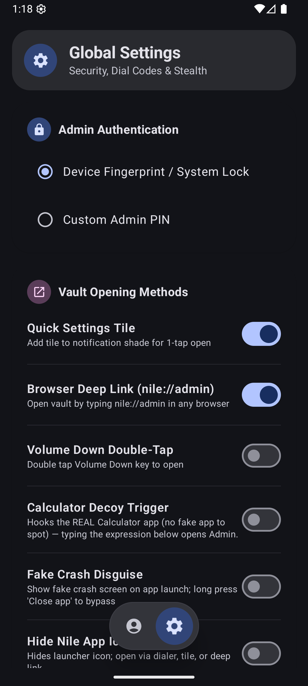
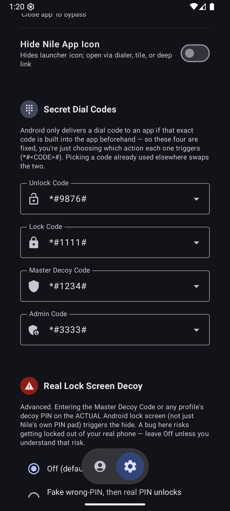

# The Nile

> *"Denial is not just a river in Egypt"*

**The Nile** is a root-enabled Android stealth deniability engine designed to protect user privacy and sensitive data under duress. Built by **binkemet**, it offers true plausible deniability through hardware-backed encrypted storage, application cloaking via LSPosed, and multi-state vault functionality.

---

## Features

- 🔒 **Multi-state vault** (Locked/Unlocked/Decoy)
- 📱 **Dial code activation** via phone dialer (`*#*#CODE#*#*`)
- 🎭 **Calculator decoy app disguise**
- 💥 **Fake crash screen disguise** (long-press bypass)
- 👤 **Multi-profile support** with per-profile decoy PINs
- 🔐 **AES-256-GCM encrypted backups** (Rust native crypto)
- 📦 **App hiding** via LSPosed/Xposed
- 📁 **Directory hiding** with LUKS containers
- 🧹 **Trace cleaning** (logs, recent tasks)
- 🎨 **Material You / Dynamic theming**
- ⌨️ **Quick Settings tile**, deep links, volume key shortcuts
- 🙈 **Launcher icon hiding**

---

## Screenshots

<p>
  
  
  
</p>

---

## Requirements

- **Root Access**: KernelSU or Magisk (with Superuser permissions)
- **Xposed Framework**: LSPosed or ZygiskNext (required for system-level app hiding)
- **Android Version**: Android 7.0+ (API level 24+)

---

## Building from Source

```bash
git clone https://github.com/binkemet/thenile.git
cd thenile
./gradlew assembleDebug
```

---

## Donations

- **Bitcoin**: `bc1qy654gnq6jwxuk54q7lnvntrkshgaflwhnhm7qu`
- **Monero**: `89Sd2SnrwCtJEzoens2R5T13uBoqe9ru5VVJDDfBR3Md14jEFA5fFkZB4D9CAdz7fHNS8fyKZK5DYXrMSXWpMnZcQnaqRuu`

---

## License

This project is licensed under the **GNU General Public License v3.0** (GPL-3.0). See the [LICENSE](LICENSE) file for details.

Copyright (c) 2024 binkemet.

---

## Disclaimer

The Nile is intended for privacy preservation, protection against forced disclosure, and security research. The author assumes no liability for misuse, data loss, or violation of local laws.

**Do not use this app to cheat on a partner.** It is not a tool for hiding infidelity, and using it that way is on you, not the software.

**Do not rely on this app when police or other authorities lawfully compel you to unlock your device.**
